# Components 组件总览

## 概述
Comedot 框架的组件系统采用了组合模式（Composition Pattern），提供了一套完整的组件化架构。每个组件都继承自基础的 `Component` 类，负责实现特定的行为或功能。

## 🏗️ 组件继承关系 - UML类图

```mermaid
classDiagram
    Node <|-- Component
    Component <|-- NodeModifierComponentBase
    Component <|-- DebugComponent
    Component <|-- TimerComponentBase
    Component <|-- InputDependentComponentBase
    Component <|-- AreaComponentBase
    Component <|-- CharacterBodyDependentComponentBase
    Component <|-- ActionTargetingComponentBase
    
    %% 基础组件
    class Component {
        <<abstract>>
        +parentEntity: Entity
        +coComponents: Dictionary
        +willRemoveFromEntity()
        +getRequiredComponents(): Array[Script]
        +validateParent()
        +registerEntity()
        +removeFromEntity()
    }
    
    %% 修改器基类
    class NodeModifierComponentBase {
        <<abstract>>
        +shouldRemoveEntity: bool
        +nodesToRemove: Array[Node]
        +componentsToRemove: Array[Script]
        +componentsToCreate: Array[Script]
        +payload: Payload
        +performAllModifications()
    }
    
    %% 调试组件
    class DebugComponent {
        +propertiesToLabel: Array[NodePath]
        +propertiesToChart: Array[NodePath]
        +shouldHideLabelsUntilHover: bool
        +createCharts()
        +updatePropertiesLabel()
    }
    
    %% 定时器基类
    class TimerComponentBase {
        <<abstract>>
        +isEnabled: bool
        +shouldAutoStart: bool
        +timeoutSignal: Signal
    }
    
    %% 输入依赖基类
    class InputDependentComponentBase {
        <<abstract>>
        +inputComponent: InputComponent
        +getInputComponent(): InputComponent
    }
    
    %% 区域基类
    class AreaComponentBase {
        <<abstract>>
        +parentArea: Area2D
        +findParentArea(): Area2D
        +registerArea()
    }
    
    %% 角色体依赖基类
    class CharacterBodyDependentComponentBase {
        <<abstract>>
        +characterBody: CharacterBody2D
        +findCharacterBody(): CharacterBody2D
    }
    
    %% 动作目标基类
    class ActionTargetingComponentBase {
        <<abstract>>
        +isEnabled: bool
        +updateTargetPosition()
    }
    
    %% 具体组件示例
    NodeModifierComponentBase <|-- ModifyOnTimerComponent
    NodeModifierComponentBase <|-- ModifyOnCollisionComponent
    TimerComponentBase <|-- TimerAgentComponentBase
    InputDependentComponentBase <|-- InputComponent
    AreaComponentBase <|-- AreaCollisionComponent
    CharacterBodyDependentComponentBase <|-- PlatformerPhysicsComponent
    ActionTargetingComponentBase <|-- ActionTargetingMouseComponent
    
    %% 功能组件
    Component <|-- HealthComponent
    Component <|-- MovementComponent
    Component <|-- NavigationComponent
    Component <|-- StatsComponent
    Component <|-- ActionsComponent
    Component <|-- InventoryComponent
    Component <|-- CameraComponent
    Component <|-- AnimationComponent
```



## 📁 文件树结构

```
Components/
├── 📄 Component.gd                          # 基础组件类
├── 📄 Component.md                          # 基础组件文档
├── 📄 NodeModifierComponentBase.gd          # 修改器基类
├── 📄 NodeModifierComponentBase.md          # 修改器基类文档
├── 📄 DebugComponent.gd                     # 调试组件
├── 📄 DebugComponent.md                     # 调试组件文档
│
├── 🤖 AI/                                   # AI相关组件
│   └── 📄 TimerAgentComponentBase.gd        # 定时器AI代理基类
│
├── ⚔️ Combat/                               # 战斗相关组件
│   ├── 📄 HealthComponent.gd                # 生命值组件
│   ├── 📄 DamageComponent.gd                # 伤害组件
│   ├── 📄 DamageReceivingComponent.gd       # 伤害接收组件
│   ├── 📄 GunComponent.gd                   # 枪械组件
│   ├── 📄 FactionComponent.gd               # 阵营组件
│   ├── 📄 ShieldedHealthComponent.gd        # 护盾生命值组件
│   ├── 📄 InvulnerabilityOnHitComponent.gd  # 受击无敌组件
│   ├── 📄 KnockbackOnHitComponent.gd        # 击退组件
│   ├── 📄 BulletModifierComponent.gd        # 子弹修改组件
│   ├── 📄 DamageRayComponent.gd             # 射线伤害组件
│   ├── 📄 DamageOverTimeComponent.gd        # 持续伤害组件
│   ├── 📄 DamageRepeatingComponent.gd       # 重复伤害组件
│   └── 📄 TileDamageComponent.gd            # 瓦片伤害组件
│
├── 🎮 Control/                              # 控制相关组件
│   ├── 📄 InputComponent.gd                 # 输入组件
│   ├── 📄 ActionControlComponent.gd         # 动作控制组件
│   ├── 📄 PlatformerControlComponent.gd     # 平台控制组件
│   ├── 📄 OverheadControlComponent.gd       # 俯视控制组件
│   ├── 📄 TileBasedControlComponent.gd      # 瓦片控制组件
│   ├── 📄 MouseRotationComponent.gd         # 鼠标旋转组件
│   ├── 📄 MouseTrackingComponent.gd         # 鼠标追踪组件
│   ├── 📄 JumpComponent.gd                  # 跳跃组件
│   ├── 📄 ClimbComponent.gd                 # 攀爬组件
│   ├── 📄 ThrustControlComponent.gd         # 推进控制组件
│   ├── 📄 TurningControlComponent.gd        # 转向控制组件
│   ├── 📄 AsteroidsControlComponent.gd      # 小行星控制组件
│   ├── 📄 InteractionControlComponent.gd    # 交互控制组件
│   ├── 📄 PositionControlComponent.gd       # 位置控制组件
│   ├── 📄 ScrollerControlComponent.gd       # 滚动控制组件
│   ├── 📄 TileBasedMouseControlComponent.gd # 瓦片鼠标控制组件
│   └── 📄 ActionTargeting*.gd               # 动作目标相关组件
│
├── 📊 Data/                                 # 数据相关组件
│   ├── 📄 StatsComponent.gd                 # 统计组件
│   └── 📄 StatModifierComponent.gd          # 属性修改组件
│
├── 🎯 Gameplay/                             # 游戏玩法组件
│   ├── 📄 ActionsComponent.gd               # 动作组件
│   ├── 📄 InventoryComponent.gd             # 物品栏组件
│   ├── 📄 UpgradesComponent.gd              # 升级组件
│   ├── 📄 CooldownComponent.gd              # 冷却组件
│   ├── 📄 InjectorComponent.gd              # 注入组件
│   ├── 📄 LevelUpComponent.gd               # 升级组件
│   ├── 📄 ActionTargetableComponent.gd      # 动作目标组件
│   ├── 📄 TextInteractionComponent.gd       # 文本交互组件
│   ├── 📄 ModifyOnTimerComponent.gd         # 定时器修改组件
│   ├── 📄 StatModifierOnDeathComponent.gd   # 死亡属性修改组件
│   └── 📄 TimerComponentBase.gd             # 定时器基类
│
├── 🏃 Movement/                             # 移动相关组件
│   ├── 📄 NavigationComponent.gd            # 导航组件
│   ├── 📄 ChaseComponent.gd                 # 追逐组件
│   ├── 📄 LinearMotionComponent.gd          # 线性移动组件
│   ├── 📄 PathFollowComponent.gd            # 路径跟随组件
│   ├── 📄 AttachmentComponent.gd            # 附着组件
│   ├── 📄 SpinComponent.gd                  # 旋转组件
│   ├── 📄 WaveMotionComponent.gd            # 波浪运动组件
│   ├── 📄 RideableComponent.gd              # 可骑乘组件
│   ├── 📄 TileBasedPositionComponent.gd     # 瓦片位置组件
│   ├── 📄 PositionClampComponent.gd         # 位置限制组件
│   ├── 📄 PlatformerPatrolComponent.gd      # 平台巡逻组件
│   └── 📄 *Movement*.gd                     # 其他移动组件
│
├── 🎁 Objects/                              # 对象相关组件
│   ├── 📄 CollectibleComponent.gd           # 可收集组件
│   ├── 📄 CollectorComponent.gd             # 收集器组件
│   ├── 📄 InteractionComponent.gd           # 交互组件
│   ├── 📄 PortalInteractionComponent.gd     # 传送门交互组件
│   ├── 📄 ModalInteractionComponent.gd      # 模态交互组件
│   ├── 📄 InteractionWithCostComponent.gd   # 有成本交互组件
│   ├── 📄 MineableComponent.gd              # 可挖掘组件
│   ├── 📄 DropOnDeathComponent.gd           # 死亡掉落组件
│   ├── 📄 CollectibleStatComponent.gd       # 可收集属性组件
│   └── 📄 CollectibleInventoryComponent.gd  # 可收集物品组件
│
├── ⚡ Physics/                              # 物理相关组件
│   ├── 📄 CharacterBodyComponent.gd         # 角色体组件
│   ├── 📄 PlatformerPhysicsComponent.gd     # 平台物理组件
│   ├── 📄 OverheadPhysicsComponent.gd       # 俯视物理组件
│   ├── 📄 GravityComponent.gd               # 重力组件
│   ├── 📄 AreaCollisionComponent.gd         # 区域碰撞组件
│   ├── 📄 AreaContactComponent.gd           # 区域接触组件
│   ├── 📄 ModifyOnCollisionComponent.gd     # 碰撞修改组件
│   ├── 📄 TileCollisionComponent.gd         # 瓦片碰撞组件
│   ├── 📄 CornerCollisionComponent.gd       # 角落碰撞组件
│   ├── 📄 PushRigidBodyComponent.gd         # 推动刚体组件
│   ├── 📄 GunRecoilComponent.gd             # 枪械后坐力组件
│   ├── 📄 VelocityClampComponent.gd         # 速度限制组件
│   └── 📄 *ComponentBase.gd                 # 基类组件
│
├── 🔄 TurnBased/                            # 回合制相关组件
│   ├── 📄 TurnBasedComponent.gd             # 回合制组件
│   ├── 📄 TurnBasedAnimationComponent.gd    # 回合制动画组件
│   ├── 📄 TurnBasedStateUIComponent.gd      # 回合制状态UI组件
│   ├── 📄 TurnBasedTileBasedControlComponent.gd      # 回合制瓦片控制组件
│   ├── 📄 TurnBasedTileBasedGravityComponent.gd      # 回合制瓦片重力组件
│   └── 📄 TurnBasedTileBasedPlatformerControlComponent.gd  # 回合制瓦片平台控制组件
│
└── 🎨 Visual/                               # 视觉相关组件
    ├── 📄 CameraComponent.gd                # 摄像机组件
    ├── 📄 PlatformerAnimationComponent.gd   # 平台动画组件
    ├── 📄 TileBasedAnimationComponent.gd    # 瓦片动画组件
    ├── 📄 HealthVisualComponent.gd          # 生命值可视化组件
    ├── 📄 DamageVisualComponent.gd          # 伤害可视化组件
    ├── 📄 StatsVisualComponent.gd           # 统计可视化组件
    ├── 📄 LabelComponent.gd                 # 标签组件
    ├── 📄 BlinkPauseComponent.gd            # 闪烁暂停组件
    ├── 📄 NodeFacingComponent.gd            # 节点朝向组件
    ├── 📄 CompassComponent.gd               # 指南针组件
    ├── 📄 ShapeDrawComponent.gd             # 形状绘制组件
    └── 📄 OffscreenRemovalComponent.gd      # 离屏移除组件
```

## 📋 组件清单

### 🏗️ 基础组件

#### [Component](./Component.md)
**抽象基类** - 所有组件的基础类，提供实体关系管理和生命周期控制。

#### [NodeModifierComponentBase](./NodeModifierComponentBase.md)
**修改器基类** - 用于动态添加/移除组件、节点或实体本身的基础类。

#### [DebugComponent](./DebugComponent.md)
**调试组件** - 显示实体和组件的调试信息，支持实时标签和图表。

---

### 🤖 AI 组件

#### [TimerAgentComponentBase](./AI/TimerAgentComponentBase.md)
**定时器AI基类** - 为基于定时器的AI代理提供基础功能。

---

### ⚔️ 战斗组件

#### [HealthComponent](./Combat/HealthComponent.md)
**生命值组件** - 管理实体的生命值，支持伤害处理和死亡行为。

#### [DamageComponent](./Combat/DamageComponent.md)
**伤害组件** - 处理伤害输出，支持多种伤害类型和阵营检查。

#### [DamageReceivingComponent](./Combat/DamageReceivingComponent.md)
**伤害接收组件** - 接收并处理伤害，与HealthComponent协作。

#### [GunComponent](./Combat/GunComponent.md)
**枪械组件** - 实现射击武器功能，支持子弹生成和弹道计算。

#### [FactionComponent](./Combat/FactionComponent.md)
**阵营组件** - 管理实体的阵营关系，用于敌友识别。

#### [ShieldedHealthComponent](./Combat/ShieldedHealthComponent.md)
**护盾生命值组件** - 带护盾的生命值系统，支持护盾层数和恢复。

#### [InvulnerabilityOnHitComponent](./Combat/InvulnerabilityOnHitComponent.md)
**受击无敌组件** - 受击后提供短暂无敌时间。

#### [KnockbackOnHitComponent](./Combat/KnockbackOnHitComponent.md)
**击退组件** - 受击时产生击退效果。

#### [BulletModifierComponent](./Combat/BulletModifierComponent.md)
**子弹修改组件** - 修改子弹的属性和行为。

#### [DamageRayComponent](./Combat/DamageRayComponent.md)
**射线伤害组件** - 使用射线检测的即时伤害。

#### [DamageOverTimeComponent](./Combat/DamageOverTimeComponent.md)
**持续伤害组件** - 在时间内持续造成伤害。

#### [DamageRepeatingComponent](./Combat/DamageRepeatingComponent.md)
**重复伤害组件** - 定期重复造成伤害。

#### [TileDamageComponent](./Combat/TileDamageComponent.md)
**瓦片伤害组件** - 对瓦片地图造成伤害。

---

### 🎮 控制组件

#### [InputComponent](./Control/InputComponent.md)
**输入组件** - 统一的输入状态管理，支持玩家和AI控制。

#### [ActionControlComponent](./Control/ActionControlComponent.md)
**动作控制组件** - 管理实体的动作执行和控制。

#### [PlatformerControlComponent](./Control/PlatformerControlComponent.md)
**平台控制组件** - 2D平台游戏的角色控制。

#### [OverheadControlComponent](./Control/OverheadControlComponent.md)
**俯视控制组件** - 俯视角游戏的移动控制。

#### [TileBasedControlComponent](./Control/TileBasedControlComponent.md)
**瓦片控制组件** - 基于瓦片的网格移动控制。

#### [MouseRotationComponent](./Control/MouseRotationComponent.md)
**鼠标旋转组件** - 根据鼠标位置旋转实体。

#### [MouseTrackingComponent](./Control/MouseTrackingComponent.md)
**鼠标追踪组件** - 跟踪鼠标位置进行移动。

#### [JumpComponent](./Control/JumpComponent.md)
**跳跃组件** - 实现跳跃功能，支持多段跳和土狼时间。

#### [ClimbComponent](./Control/ClimbComponent.md)
**攀爬组件** - 实现墙壁攀爬功能。

#### [ThrustControlComponent](./Control/ThrustControlComponent.md)
**推进控制组件** - 类似太空船的推进控制。

#### [TurningControlComponent](./Control/TurningControlComponent.md)
**转向控制组件** - 平滑的转向控制。

#### [AsteroidsControlComponent](./Control/AsteroidsControlComponent.md)
**小行星控制组件** - 经典小行星游戏的控制方式。

#### [InteractionControlComponent](./Control/InteractionControlComponent.md)
**交互控制组件** - 处理与环境的交互。

#### [PositionControlComponent](./Control/PositionControlComponent.md)
**位置控制组件** - 直接控制实体位置。

#### [ScrollerControlComponent](./Control/ScrollerControlComponent.md)
**滚动控制组件** - 自动滚动游戏的控制。

#### [TileBasedMouseControlComponent](./Control/TileBasedMouseControlComponent.md)
**瓦片鼠标控制组件** - 基于瓦片网格的鼠标控制。

#### [ActionTargetingComponentBase](./Control/ActionTargetingComponentBase.md)
**动作目标基类** - 动作目标系统的基础类。

#### [ActionTargetingCursorComponentBase](./Control/ActionTargetingCursorComponentBase.md)
**动作目标光标基类** - 光标目标系统的基础类。

#### [ActionTargetingMouseComponent](./Control/ActionTargetingMouseComponent.md)
**鼠标目标组件** - 使用鼠标进行动作目标定位。

#### [InputDependentComponentBase](./Control/InputDependentComponentBase.md)
**输入依赖基类** - 依赖输入组件的组件基类。

#### [StationaryHidingPositionControlComponent](./Control/StationaryHidingPositionControlComponent.md)
**固定隐藏位置控制组件** - 固定位置的隐藏控制。

---

### 📊 数据组件

#### [StatsComponent](./Data/StatsComponent.md)
**统计组件** - 管理实体的各项属性统计。

#### [StatModifierComponent](./Data/StatModifierComponent.md)
**属性修改组件** - 修改其他组件的属性值。

---

### 🎯 游戏玩法组件

#### [ActionsComponent](./Gameplay/ActionsComponent.md)
**动作组件** - 管理实体可执行的动作集合。

#### [InventoryComponent](./Gameplay/InventoryComponent.md)
**物品栏组件** - 管理实体的物品库存。

#### [UpgradesComponent](./Gameplay/UpgradesComponent.md)
**升级组件** - 处理实体的升级系统。

#### [CooldownComponent](./Gameplay/CooldownComponent.md)
**冷却组件** - 管理动作和能力的冷却时间。

#### [InjectorComponent](./Gameplay/InjectorComponent.md)
**注入组件** - 动态注入其他组件到实体。

#### [LevelUpComponent](./Gameplay/LevelUpComponent.md)
**升级组件** - 处理等级提升逻辑。

#### [ActionTargetableComponent](./Gameplay/ActionTargetableComponent.md)
**动作目标组件** - 使实体成为动作的目标。

#### [TextInteractionComponent](./Gameplay/TextInteractionComponent.md)
**文本交互组件** - 处理文本对话和交互。

#### [ModifyOnTimerComponent](./Gameplay/ModifyOnTimerComponent.md)
**定时修改组件** - 基于定时器的实体修改。

#### [StatModifierOnDeathComponent](./Gameplay/StatModifierOnDeathComponent.md)
**死亡属性修改组件** - 死亡时修改属性。

#### [TimerComponentBase](./Gameplay/TimerComponentBase.md)
**定时器基类** - 基于定时器的组件基础类。

---

### 🏃 移动组件

#### [NavigationComponent](./Movement/NavigationComponent.md)
**导航组件** - 基于NavigationAgent2D的智能寻路。

#### [ChaseComponent](./Movement/ChaseComponent.md)
**追逐组件** - 追踪目标实体的移动。

#### [LinearMotionComponent](./Movement/LinearMotionComponent.md)
**线性运动组件** - 直线运动控制。

#### [PathFollowComponent](./Movement/PathFollowComponent.md)
**路径跟随组件** - 沿预定路径移动。

#### [AttachmentComponent](./Movement/AttachmentComponent.md)
**附着组件** - 将实体附着到其他节点。

#### [SpinComponent](./Movement/SpinComponent.md)
**旋转组件** - 持续旋转运动。

#### [WaveMotionComponent](./Movement/WaveMotionComponent.md)
**波浪运动组件** - 波浪形运动轨迹。

#### [RideableComponent](./Movement/RideableComponent.md)
**可骑乘组件** - 允许其他实体骑乘。

#### [TileBasedPositionComponent](./Movement/TileBasedPositionComponent.md)
**瓦片位置组件** - 基于瓦片网格的位置管理。

#### [PositionClampComponent](./Movement/PositionClampComponent.md)
**位置限制组件** - 限制实体在指定区域内移动。

#### [PlatformerPatrolComponent](./Movement/PlatformerPatrolComponent.md)
**平台巡逻组件** - 平台游戏的AI巡逻行为。

#### [IndependentPathFollowComponent](./Movement/IndependentPathFollowComponent.md)
**独立路径跟随组件** - 独立的路径跟随系统。

#### [RelativePathMovementComponent](./Movement/RelativePathMovementComponent.md)
**相对路径移动组件** - 相对于参考点的路径移动。

#### [TileBasedRandomMovementComponent](./Movement/TileBasedRandomMovementComponent.md)
**瓦片随机移动组件** - 在瓦片网格上的随机移动。

---

### 🎁 对象组件

#### [CollectibleComponent](./Objects/CollectibleComponent.md)
**可收集组件** - 使对象可被收集。

#### [CollectorComponent](./Objects/CollectorComponent.md)
**收集器组件** - 能够收集物品的功能。

#### [InteractionComponent](./Objects/InteractionComponent.md)
**交互组件** - 基础的交互功能。

#### [PortalInteractionComponent](./Objects/PortalInteractionComponent.md)
**传送门交互组件** - 传送门的交互逻辑。

#### [ModalInteractionComponent](./Objects/ModalInteractionComponent.md)
**模态交互组件** - 模态窗口的交互。

#### [InteractionWithCostComponent](./Objects/InteractionWithCostComponent.md)
**有成本交互组件** - 需要消耗资源的交互。

#### [MineableComponent](./Objects/MineableComponent.md)
**可挖掘组件** - 可被挖掘的对象。

#### [DropOnDeathComponent](./Objects/DropOnDeathComponent.md)
**死亡掉落组件** - 死亡时掉落物品。

#### [CollectibleStatComponent](./Objects/CollectibleStatComponent.md)
**可收集属性组件** - 收集时影响属性的物品。

#### [CollectibleInventoryComponent](./Objects/CollectibleInventoryComponent.md)
**可收集物品组件** - 收集时进入物品栏的物品。

---

### ⚡ 物理组件

#### [CharacterBodyComponent](./Physics/CharacterBodyComponent.md)
**角色体组件** - CharacterBody2D的封装组件。

#### [PlatformerPhysicsComponent](./Physics/PlatformerPhysicsComponent.md)
**平台物理组件** - 2D平台游戏的物理处理。

#### [OverheadPhysicsComponent](./Physics/OverheadPhysicsComponent.md)
**俯视物理组件** - 俯视角游戏的物理处理。

#### [GravityComponent](./Physics/GravityComponent.md)
**重力组件** - 应用重力效果。

#### [AreaCollisionComponent](./Physics/AreaCollisionComponent.md)
**区域碰撞组件** - 基于Area2D的碰撞检测。

#### [AreaContactComponent](./Physics/AreaContactComponent.md)
**区域接触组件** - 区域接触检测和处理。

#### [ModifyOnCollisionComponent](./Physics/ModifyOnCollisionComponent.md)
**碰撞修改组件** - 碰撞时修改实体。

#### [TileCollisionComponent](./Physics/TileCollisionComponent.md)
**瓦片碰撞组件** - 与瓦片地图的碰撞检测。

#### [CornerCollisionComponent](./Physics/CornerCollisionComponent.md)
**角落碰撞组件** - 角落和边缘的碰撞处理。

#### [PushRigidBodyComponent](./Physics/PushRigidBodyComponent.md)
**推动刚体组件** - 推动RigidBody2D对象。

#### [GunRecoilComponent](./Physics/GunRecoilComponent.md)
**枪械后坐力组件** - 射击时的后坐力效果。

#### [VelocityClampComponent](./Physics/VelocityClampComponent.md)
**速度限制组件** - 限制实体的移动速度。

#### [AreaComponentBase](./Physics/AreaComponentBase.md)
**区域组件基类** - 基于Area2D的组件基础类。

#### [CharacterBodyDependentComponentBase](./Physics/CharacterBodyDependentComponentBase.md)
**角色体依赖基类** - 依赖CharacterBody2D的组件基类。

---

### 🔄 回合制组件

#### [TurnBasedComponent](./TurnBased/TurnBasedComponent.md)
**回合制组件** - 回合制游戏的基础组件。

#### [TurnBasedAnimationComponent](./TurnBased/TurnBasedAnimationComponent.md)
**回合制动画组件** - 回合制游戏的动画控制。

#### [TurnBasedStateUIComponent](./TurnBased/TurnBasedStateUIComponent.md)
**回合制状态UI组件** - 回合制游戏的状态界面。

#### [TurnBasedTileBasedControlComponent](./TurnBased/TurnBasedTileBasedControlComponent.md)
**回合制瓦片控制组件** - 回合制瓦片游戏的控制。

#### [TurnBasedTileBasedGravityComponent](./TurnBased/TurnBasedTileBasedGravityComponent.md)
**回合制瓦片重力组件** - 回合制瓦片游戏的重力系统。

#### [TurnBasedTileBasedPlatformerControlComponent](./TurnBased/TurnBasedTileBasedPlatformerControlComponent.md)
**回合制瓦片平台控制组件** - 回合制瓦片平台游戏的控制。

---

### 🎨 视觉组件

#### [CameraComponent](./Visual/CameraComponent.md)
**摄像机组件** - 摄像机控制和跟随。

#### [PlatformerAnimationComponent](./Visual/PlatformerAnimationComponent.md)
**平台动画组件** - 平台游戏的角色动画。

#### [TileBasedAnimationComponent](./Visual/TileBasedAnimationComponent.md)
**瓦片动画组件** - 基于瓦片的动画控制。

#### [HealthVisualComponent](./Visual/HealthVisualComponent.md)
**生命值可视化组件** - 生命值的可视化显示。

#### [DamageVisualComponent](./Visual/DamageVisualComponent.md)
**伤害可视化组件** - 伤害效果的可视化。

#### [StatsVisualComponent](./Visual/StatsVisualComponent.md)
**统计可视化组件** - 属性统计的可视化显示。

#### [LabelComponent](./Visual/LabelComponent.md)
**标签组件** - 文本标签显示。

#### [BlinkPauseComponent](./Visual/BlinkPauseComponent.md)
**闪烁暂停组件** - 暂停时的闪烁效果。

#### [NodeFacingComponent](./Visual/NodeFacingComponent.md)
**节点朝向组件** - 控制节点朝向。

#### [CompassComponent](./Visual/CompassComponent.md)
**指南针组件** - 指南针显示功能。

#### [ShapeDrawComponent](./Visual/ShapeDrawComponent.md)
**形状绘制组件** - 绘制几何形状。

#### [OffscreenRemovalComponent](./Visual/OffscreenRemovalComponent.md)
**离屏移除组件** - 离开屏幕时自动移除。

---

## 🎯 组件使用指南

### 基本使用模式

1. **创建实体**：继承自Entity类
2. **添加组件**：作为子节点添加到实体
3. **配置组件**：设置导出属性
4. **组件通信**：通过coComponents访问其他组件

### 最佳实践

1. **组件职责单一**：每个组件只负责一个特定功能
2. **依赖声明**：重写getRequiredComponents()声明依赖
3. **信号通信**：使用信号进行组件间通信
4. **状态管理**：使用isEnabled控制组件启用状态

### 架构模式

- **组合优于继承**：通过组合不同组件实现复杂行为
- **数据驱动**：使用Resource文件配置组件参数
- **事件驱动**：使用信号系统实现松耦合
- **可重用性**：组件可在不同实体间复用

---

## 🔗 相关文档

- [Entity系统文档](../Entities/Entity.md)
- [组件使用示例](../Templates/Examples/)
- [框架架构说明](../HowTo.md)
- [贡献指南](../CONTRIBUTING.md)